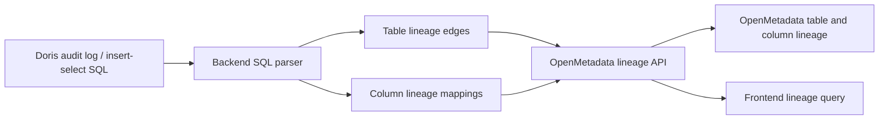
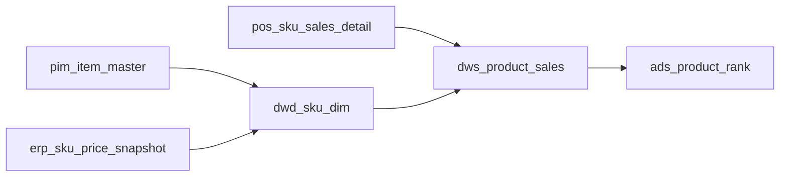

# Retail Lineage Design

## Purpose

This document consolidates the retail lineage feature design and ETL simulation design. The feature focuses on a fashion retail scenario and connects Doris audit/ETL SQL, local lineage snapshots and OpenMetadata lineage APIs.

## Business Scope

The demo covers six retail domains:

- Product: PIM product master, SKU price, product dimension, product sales summary and hot product dashboard.
- Inventory: warehouse stock, store stock, inventory snapshot, turnover summary and inventory alert dashboard.
- Order: POS orders, e-commerce orders, unified order fact, daily sales and GMV dashboard.
- Member: CRM member master, member profile, RFM summary, operation and retention dashboards.
- Marketing: campaign config, coupon delivery, campaign events, conversion summary and ROI dashboard.
- Store: store daily KPI and store operation dashboard.

## Core Flow



## Doris Objects

Database: `retail_lineage`

Main tables:

- `lineage_domain`: business domain metadata.
- `lineage_asset`: lineage asset nodes such as source tables, Doris tables, pipelines and dashboards.
- `lineage_edge`: asset-level lineage edges.
- `lineage_impact`: impact analysis data.
- `lineage_snapshot`: lineage graph snapshots.
- `lineage_sync_log`: OpenMetadata sync history.
- `etl_task`: ETL task metadata.
- `etl_task_input`: ETL upstream table mappings.
- `etl_task_output`: ETL downstream table mappings.

## ETL Simulation Rules

- Each ETL task should connect one or more upstream source tables to one downstream target table.
- DWD jobs standardize source data.
- DWS jobs aggregate metrics.
- ADS jobs prepare dashboard/report data.
- Complex SQL should include joins, filters, window functions and expressions where possible.

## Example Product Lineage



## OpenMetadata Mapping

- Doris table assets map to OpenMetadata `Table` entities.
- ETL tasks map to OpenMetadata `Pipeline` entities when available.
- Dashboards map to OpenMetadata dashboard/report entities when available.
- Table-level lineage maps to `AddLineageRequest.edge`.
- Column-level lineage maps to `lineageDetails.columnsLineage`.

## Frontend Pages

The lineage page uses two main tabs:

- Table lineage: graph view, upstream/downstream list, raw OpenMetadata JSON.
- Column lineage: upstream field mappings, downstream field mappings, expression display.

The sync page shows audit-log SQL sync results:

- Time
- Type
- User
- Target table
- Source tables
- Success/failure
- Error message

## SQL Delivery

Database scripts are organized under `sql/by_database/`:

- `retail_lineage_schema.sql`
- `retail_lineage_mock.sql`

Run:

```bash
sh init_database.sh lineage
```
